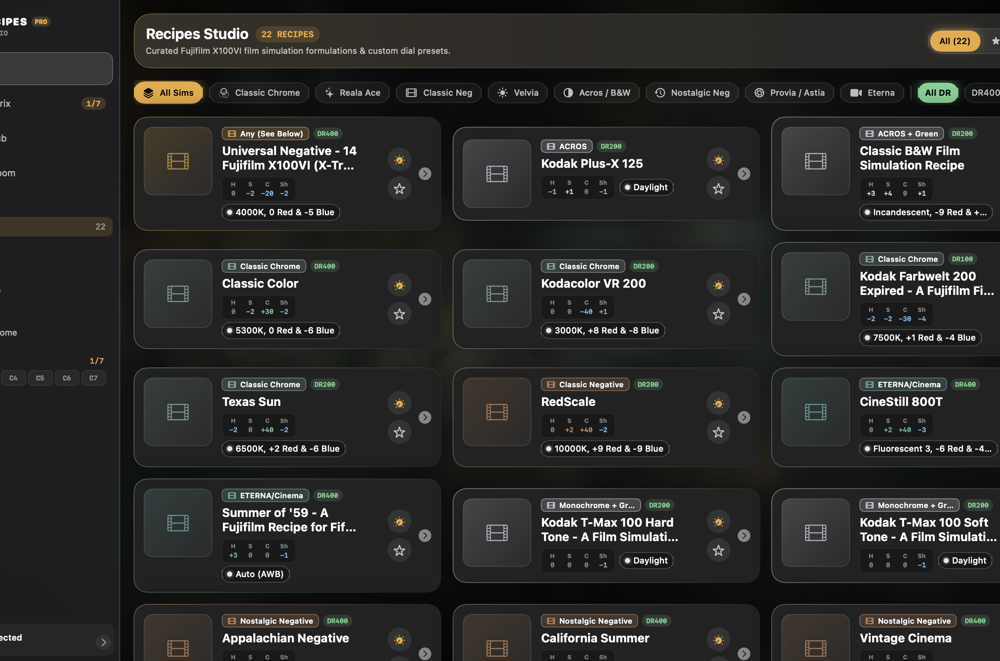
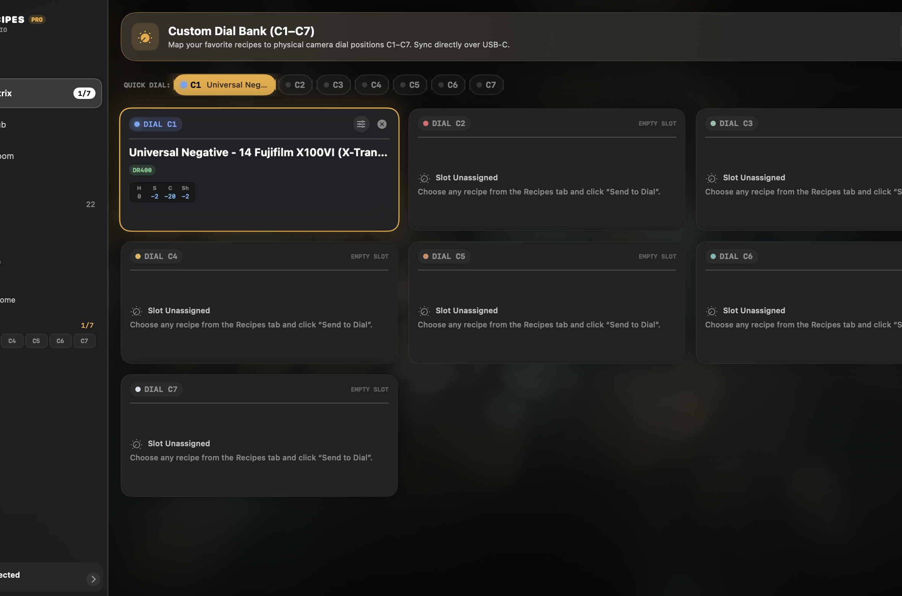
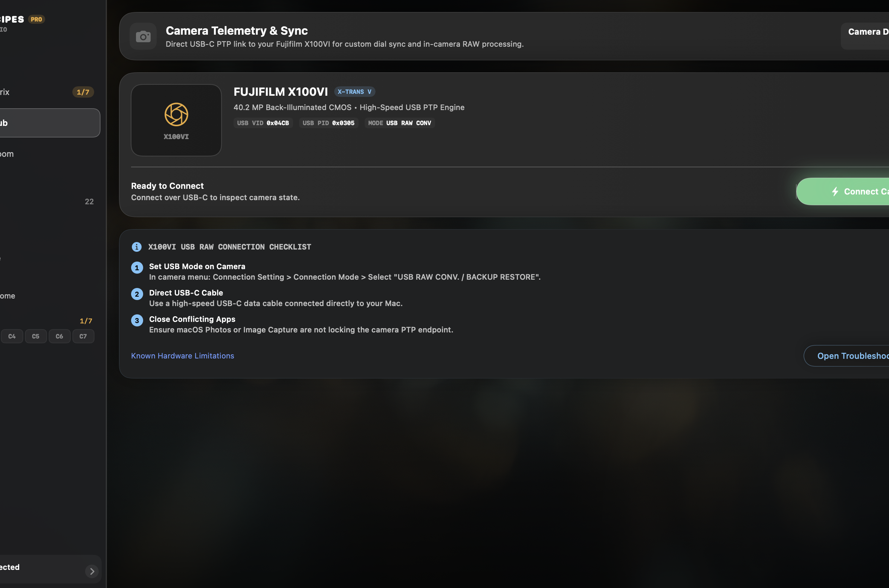
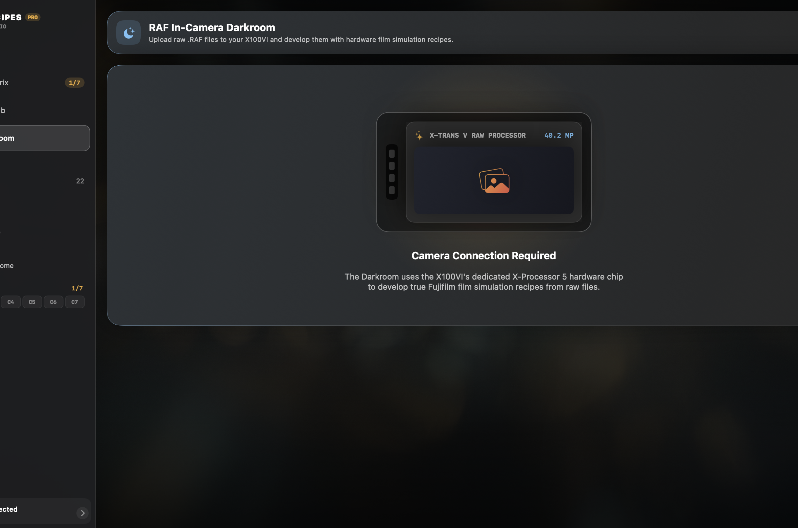

# FujiRecipes Pro — macOS & iOS Toolkit for Fujifilm X100VI

[](https://developer.apple.com/swift/)
[](https://www.apple.com/macos/)
[](https://www.apple.com/ios/)
[](#current-roadmap--wip-status)
[](LICENSE)

A cross-platform native macOS and iOS application suite designed for **Fujifilm X100VI** photographers. **FujiRecipes Pro** connects directly over USB-C (PTP) to manage camera recipes, formulate custom dial banks (**C1–C7**), and trigger in-camera RAW (`.RAF`) conversion with hardware film simulation recipes.

---

## User Interface Screenshots

### 1. Recipes Studio
Browse, search, and filter formulations by film simulation family, dynamic range, and exposure parameters. Features real-time tone curve radar indicators, color-temperature Kelvin chips, and full photo lightboxes.



### 2. Custom Dial Bank Matrix (C1–C7)
Map recipes directly to physical custom camera positions C1 through C7. Inspect tone curves and tune parameter offsets with the interactive in-place slot editor.



### 3. Camera Telemetry & Hardware Hub
Live PTP session telemetry over USB-C, device status monitoring, vendor opcode diagnostic indicators, and connection recovery troubleshooting.



### 4. In-Camera RAF Darkroom
Direct raw `.RAF` payload processing powered by the X100VI's dedicated on-sensor imaging pipeline.



---

## Key Features

- **Obsidian & Satin Glass System**: Precision camera-grade UI with dynamic ambient studio lighting, specular material strokes, and micro-interactions.
- **Adaptive Self-Scaling Engine**: Built with native fluid auto-flow grids and `ViewThatFits` wrappers for seamless responsiveness from 780px compact windows to 4K ultra-wide monitors.
- **Visual Color Radar & Planckian Kelvin Radiator**: Real-time visual feedback for highlight/shadow tone curves and calibrated color-temperature chips.
- **Rotary C1–C7 Custom Dial Matrix**: Visual loadout assigner and in-place parameter modifier.
- **In-Camera RAF Darkroom**: Direct USB RAF payload uploader utilizing the camera's dedicated X-Processor 5 imaging pipeline.
- **Instant Multi-Sim Filtering**: Filter 86+ curated X-Trans V formulations by family (*Classic Chrome, Reala Ace, Classic Neg, Velvia, Acros, Nostalgic Neg, Provia/Astia, Eterna*) or Dynamic Range (*DR100, DR200, DR400*).

---

## Architecture

```
fuji-recipes-research/
├── FujiRecipesCore/            Shared Swift package: recipe definitions, stores & PTP constants
├── FujiPTPClient/              SPM package: multi-platform PTP abstraction (libusb, libgphoto2, ImageCaptureCore)
├── FujiRecipesMac/             Native macOS SwiftUI application
│   └── macos/Source/
│       ├── App.swift           App entry point & window styling
│       ├── AppShell.swift      Responsive navigation sidebar & telemetry footer
│       ├── GlassDesign.swift   Obsidian satin glass design system & radar chips
│       ├── RecipeViews.swift   Recipe catalog, sample shot lightbox & formula inspector
│       ├── LoadoutViews.swift  C1–C7 dial assignment matrix & in-place editor
│       └── CameraViews.swift   Hardware connection telemetry & in-camera RAF darkroom
├── FujiRecipes/iOS/            iOS SwiftUI app target
├── poc-x100vi-reader/          Low-level C/libusb diagnostic client for X100VI vendor ops
└── tools/                      Python tooling for recipe data normalization & scraping
```

---

## Quick Start

### 1. Requirements
- macOS 14.0+ / Xcode 16+
- Swift 6.0 toolchain
- Fujifilm X100VI (or compatible X-Trans V body) with USB-C cable

### 2. Build and Run macOS App via Terminal

```bash
cd FujiRecipesMac/macos
swift run FujiRecipesMac
```

### 3. Open with Xcode Workspace

```bash
open FujiRecipes.xcworkspace
```

---

## Camera Connection Guide (X100VI)

To establish direct PTP communication:

1. **Set Camera Mode**: On your X100VI, open **Menu > Set-Up > Connection Setting > Connection Mode** and choose:
   ```
   USB RAW CONV. / BACKUP RESTORE
   ```
2. **Connect Cable**: Plug a high-speed USB-C data cable directly into your Mac.
3. **PTP Conflicts**: Ensure system apps like Apple Photos or Image Capture are closed if they attempt to auto-claim the camera interface.
4. **Connect**: Click **Connect Camera** in the **Camera Hub** tab.

---

## Current Roadmap & WIP Status

| Feature | Status | Notes |
| :--- | :--- | :--- |
| **86+ X-Trans V Recipe Database** | Production | Scraped, normalized, and PTP mapped |
| **macOS Fluid Glass UI** | Complete | Satin darkroom aesthetic, responsive scaling |
| **Favorites & Loadout Persistence** | Complete | Offline UserDefaults store with C1–C7 assignment |
| **Interactive In-Place Slot Editor** | Complete | Tune highlight/shadow/color/sharpness offsets |
| **USB PTP Session Management** | Verified | Tested live with X100VI hardware |
| **RAF File Upload (0x900C/0x900D)** | Verified | 83MB+ payload upload verified with zero stalls |
| **Hardware Conversion Trigger** | Verified | In-camera conversion execution |
| **Native Direct C-Slot Commit** | WIP | Replay reverse-engineered vendor sequence |

---

## Contributing & Research

Contributions, issue reports, and packet captures are welcome:
- See `docs/architecture-decision.md` for low-level protocol choices.
- See `poc-x100vi-reader/VENDOR_COMMAND_DEBUG.md` for live test analysis against X100VI hardware.

---

## License

Distributed under the MIT License. See `LICENSE` for details.
